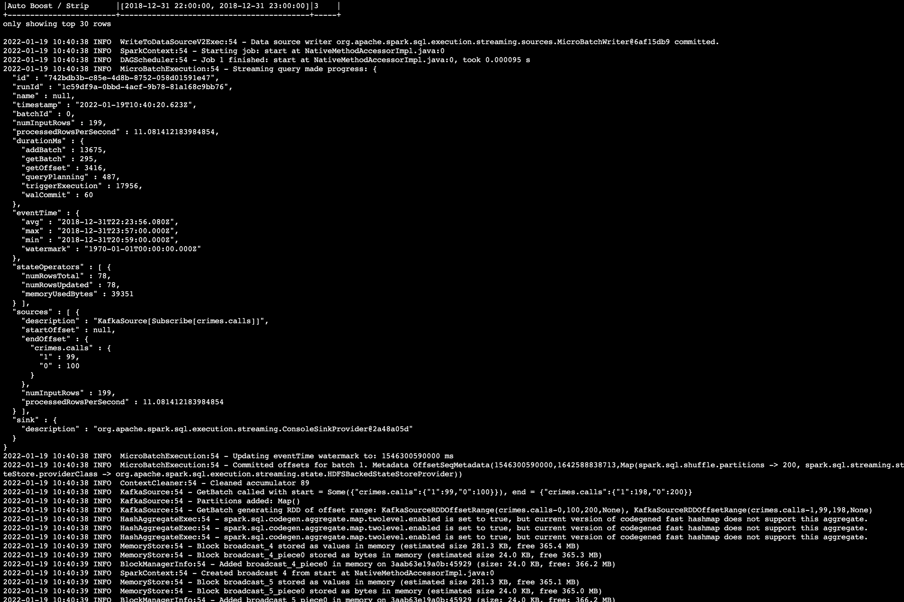

# Udacity: San Francisco Crime Statistics with Spark Streaming

This project analyses real-world dataset, extracted from Kaggle, on San Francisco crime incidents. The statistical 
analyses of the data is performed using the Open source Apache Spark Structured Streaming. 

## Description
The project ingests the provided data, generate events into a message queue, consumes messages from a queue and 
finally generates the results of the analysis. The source data is in JSON format, is converted into a format easily
consumed by the messaging system(Kafka) and the Apache Spark Streaming engine consumes these messages, performs some 
transformation and aggregation before returning results that answer the 2 important question of the project:
- What are the top types of crimes in San Francisco?
- What is the crime density by location?


## Getting Started
To get started, some opensource libraries must be available and properly installed in the environment.  Some knowledge of
Python, Apache Kafka and Apache Spark Structured Streaming.  Though Scala is used under the hood of Apache Spark, no 
knowledge of it is required.  The same applies to Java.

The main operations are found in the following files:
  - producer_server.py (prepares data for Kafka consumption)
  - data_stream.py (preforms transformation on messages ingested from Kafka queue/topic)
  - kafka_server.py (runs the producer, populating Kafka queue/topic)
  - consumer_server.py (consumes messages from Kafka queue/topic)

### Dependencies

* Unix based operating system (MacOs, Linux), Windows 10+
* [Apache Spark 2.4.3](https://spark.apache.org/)
* [Scala 2.11.x](https://scala-lang.org/)
* [Java 1.8.x](https://java.com)
* [Kafka built with Scala 2.11.x contains ZooKeeper](https://kafka.apache.org)
* [Python 3.6+](https://python.org)

### Installing

* Download and install all the above dependencies from the respective links 
* Ensure the environment variables are set on the system.  For Unix-based system, .bash_profile is the target while Windows based systems have PATHs
* Clone the project to desired location
* Install Python dependencies by run the start.sh script in the root of the project```./start.sh``` or   ``` pip install -r requirements.txt```
* Update zookeeper.properties and server.properties(Kafka) as desired.  Both .properties files can be found in the config folder.


### Executing the analytics program
With all set, run the program by following these steps:
* Start ZooKeeper server: ```bin/zookeeper-server-start.sh config/zookeeper.properties```
* If no errors, start Kafka server: ```bin/kafka-server-start.sh config/server.properties```
* Run the kafka_server.py to send incidents as messages to Kafka topic: ```python kafka_server.py```.  No response on the screen is a good sign but you have to confirm.
* Run a Kafka consumer, to see the messages generated by the producer: ```bin/kafka-console-consumer.sh --bootstrap-server localhost:<your-port-number> --topic <your-topic-name> --from-beginning --max-messages 10```. 
This returns just 10 messages.  You should see messages like this:
[consumer_screenshot]
* 
* 
* Perform data transformation and analytics by running the data_stream.py file.   
```spark-submit --packages org.apache.spark:spark-sql-kafka-0-10_2.11:2.3.4 --master local[*] data_stream.py```
For the sake of this project, the transformation/analytics results is display on the console.  Below is the screenshot of 
the progress report.



A future upgrade can write the results to a Kafka topic
that can then serve as a data source for a visualization tool.  That is out of scope of this project.  In the meantime, you can monitor the progress
* of the report visually by visiting http://localhost:3000 while the transformation is in progress.  It should look like this:


## Optimizing Spark config
__How did changing values on the SparkSession property parameters affect the throughput and latency of the data?__
There is a correlation between the Spark config parameter  ```maxOffsetsPerTrigger``` and the ```processedRowsPerSecond  and numInputRows```. 
The higher the ```maxOffsetsPerTrigger``` , the higher the  values of ```processedRowsPerSecond  and numInputRows```  which is the throughput.
The screenshots below:
### With maxOffsetsPerTrigger set to 200


### With maxOffsetsPerTrigger set to 300


After changing the processedRowsPerSecond changed so if we have a higher value in this value the throughput is better. Also the numInputRows changed.

3. What were the 2-3 most efficient SparkSession property key/value pairs? Through testing multiple variations on values, how can you tell these were the most optimal?


## Help
While running Kafka in single mode if you encounter the ```message brokers not meeting the required replication factor of 3.``` error. Simply to add ```offsets.topic.replication.factor=1```
to Kafka server configuration (found in config.server.properties)

```
ERROR [KafkaApi-0] Number of alive brokers '1' does not meet the required replication factor '3' for the offsets topic 
(configured via 'offsets.topic.replication.factor'). This error can be ignored if the cluster is starting up and not all 
brokers are up yet. (kafka.server.KafkaApis)
```

## Authors

Contributors names and contact info

ex. Ola Ajibode  
ex. [@searchs](https://github.com/searchs)

## Version History

* 0.1
    * Initial Release

## License

This project is licensed under the MIT License - see the LICENSE.md file for details

## Acknowledgments

